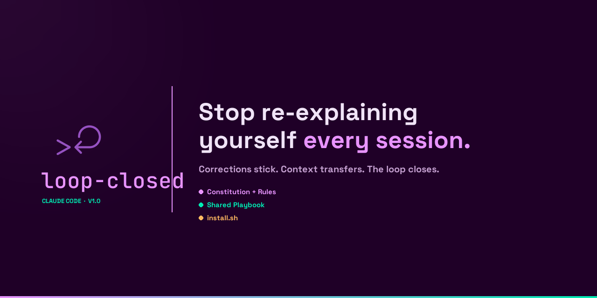

# loop-closed



Every session starts cold. Corrections evaporate. You re-explain the same context
Monday that you explained Friday.

loop-closed fixes the infrastructure problem underneath: a shared playbook both
you and your AI maintain, plus behavioral rules that auto-load on every session.
The loop closes. The relationship compounds.

## Why this name?

Every time you tell your AI something — *don't do that*, *yes, exactly like that* —
that knowledge evaporates when the session ends. The loop never closes.
This system closes it: corrections become permanent rules, confirmations get
recorded, and the next session starts already knowing what you figured out together.

## The problem

AI sessions are stateless by design. Each one starts fresh — not because the model forgot, but because it never had access to what happened before. Every correction you made last Friday disappeared. Every context you rebuilt from scratch on Monday is context you'll rebuild again next Monday. The feedback loop never closes. You keep teaching the same lessons.

## What this is

A CLAUDE.md (behavioral rules) and a shared playbook (accumulated memory) that together make sessions stateful. Not a chatbot wrapper. Not a prompt library. Infrastructure for how you work: an operating manual that auto-loads every session, plus a shared brain that both you and your AI maintain. The combination is the insight.

## Before / After

**Before:** Monday morning. Checkout flow bug is back — or maybe never fully fixed, hard to know because last Friday's session was never logged. Claude asks what framework you're using (you've answered this before). Suggests Zustand for state management (you use Jotai; corrected this twice before). Proposes the exact solution you tried two weeks ago and documented as insufficient. 40 minutes to have a conversation that mostly rebuilt context.

**After:** Claude reads the playbook. Knows the stack, knows the open issue from last session, knows not to suggest Zustand. Opens with: "Picking up the webhook retry issue — want to start with a micro-spec?" Micro-spec in 90 seconds. Two-strike rule fires when the second approach fails, pivots to a fundamentally different angle. Done in 12 minutes. Session log written before closing.

*The difference isn't intelligence. It's infrastructure.*

## What's inside

```
loop-closed/
├── system/
│   ├── CLAUDE.md              # The Constitution — behavioral rules, loaded every session
│   ├── rules/
│   │   ├── efficiency.md      # Decision tree: before any tool call, run this test
│   │   ├── memory-first.md    # Read the playbook first. Always.
│   │   ├── verification.md    # Sandbag gate + evidence gate + two-strike rule
│   │   └── scope.md           # Change only what the request names. Route the rest.
│   ├── hooks/
│   │   └── sandbag-gate.sh    # The enforcement layer — injects the gate into context
│   ├── playbook.md            # The shared brain — projects, sessions, feedback log
│   └── templates/
│       ├── spec-full.md       # For work taking >30 minutes
│       ├── spec-micro.md      # 30 seconds to fill in, prevents 30 minutes of rework
│       ├── session-log.md     # What happened, what's unresolved, next session goals
│       └── design-project.md  # For visual/UI work with a brand context
├── examples/
│   ├── playbook-filled.md     # What the playbook looks like after 1 month of real use
│   ├── session-before-after.md # Cold session vs warm session — specific, not abstract
│   └── specs-good-vs-bad.md   # Vague vs sharp: 3 pairs, 3 diagnoses
├── branding/
│   ├── logo-prompts.md        # Image generation prompts for the logo (Imagen 2)
│   └── visual-identity.md     # Color, type, what not to do
├── docs/
│   ├── philosophy.md          # The thinking behind the system
│   └── blog-post-draft.md     # The companion post
└── install.sh                 # 10-minute setup — backs up your existing CLAUDE.md
```

## Quick start

**Option A — install script (recommended):**
```bash
git clone https://github.com/marpla78/loop-closed
cd loop-closed
bash install.sh
```

**Option B — manual:**
1. Copy `system/CLAUDE.md` → `~/.claude/CLAUDE.md` (back up your existing one first)
2. Copy `system/rules/` → `~/.claude/loop-closed/rules/`
3. Copy `system/playbook.md` → `~/.claude/loop-closed/playbook.md`
4. Update `[your-system]` placeholders in `~/.claude/CLAUDE.md` to `loop-closed`
5. Edit the "About You" section

Either way: under 10 minutes.

## How it works

Two files, not one.

**The Constitution** (`system/CLAUDE.md`) holds behavioral rules — principles that apply to every session, every project. Don't start work without a spec. Verify before saying done. Two failed attempts mean the approach is wrong. These load automatically at the start of every Claude Code session.

**The shared playbook** (`system/playbook.md`) holds experiential memory — what's active, what happened last session, what corrections have been made. The AI reads it first. You both maintain it. After 10 sessions, the feedback log starts doing work you can feel.

**The sandbag hook** (`system/hooks/sandbag-gate.sh`) is the enforcement layer. Text-based rules that say "be bold" compete with trained defaults and lose — the AI reads the rule, acknowledges it, and still produces conservative output. The hook runs *outside* the generation loop and injects the gate check into context on every user message. It's the only layer where this can actually be enforced, not just documented. Without it, you're running the system with its most important structural piece missing.

Four auto-loading rules sharpen the behavioral layer:
- `efficiency.md` — a decision tree that runs before every tool call
- `memory-first.md` — read the playbook first, always; write corrections immediately
- `verification.md` — no "done" without evidence; includes the **two-strike rule**: if the same fix approach fails twice, the approach is wrong — try something fundamentally different
- `scope.md` — change only what the request names; out-of-scope observations route to the playbook feedback log instead of silently expanding the diff

## Make it yours

**Change first:** The "About You" section in `system/CLAUDE.md`. This is where you tell the AI who you are, how you work, what context it needs. Be specific. The more specific, the faster sessions start.

**Change second:** Add your active projects to `system/playbook.md`.

**Leave alone (for now):** The behavioral rules, until you've used the system for a week. They're more load-bearing than they look. After a week you'll know which ones to adjust and which ones to keep.

The system you have in a month should look different from what you installed. That's the goal.

## Honest expectations

This system provides modest value on day 1 and compounding value after 2 weeks. The feedback log needs 10+ sessions to become your institutional memory. Don't judge it by the first session.

## FAQ

**Do I need to use all of it?**
No. Start with `system/CLAUDE.md` + one rule. Add the playbook when the first one feels natural.

**Does this work with Cursor / Copilot?**
No. The auto-loading rules mechanism is Claude Code-specific. The concepts travel; the files don't.

**What happens when Claude Code updates?**
The rules might drift. Check monthly — a quick read usually reveals one or two things that need adjusting.

**Is this maintained?**
Best-effort. It's a starting point, not a service. Fork it and make it yours.

## Credits

Built by Fabi Firpo — AI Product Designer.
[X: @marpla78](https://x.com/marpla78)

Built using the system itself.

---

MIT License
